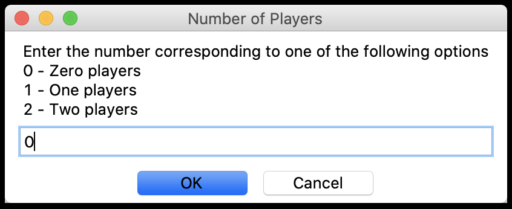
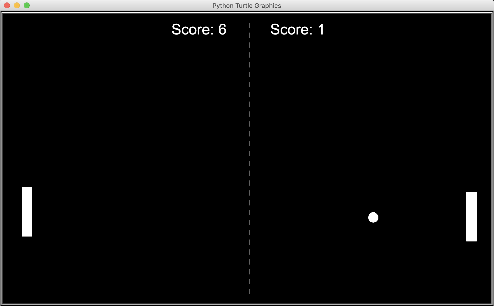
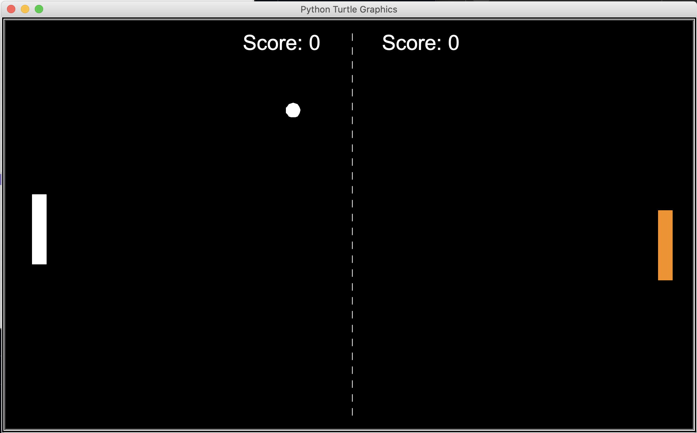

# pong_game.py :white_circle:

This project is a simple implementation of the Pong game.

The program starts by asking the user whether they want zero, one or two players, where zero players is simply the game playing against itself. 
The goal of the game is to hit the white bouncing ball with the paddles using the arrow keys for the first player along with the "w, s" keys for two players. 
When the computer plays against one player, the player's paddle is bright orange. 

Watch out for the ball, every time it hits a paddle or a wall it goes faster!
Enjoy the game! :grin:

​

​

​
